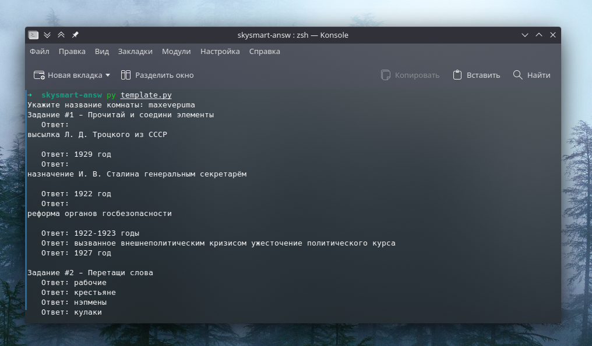

# Ответы на SkySmart
### Нужно указывать именно название комнаты, а не ссылку

Примеры:
| Ссылка  | Название комнаты |
| ------------- | ------------- |
| https://edu.skysmart.ru/student/maxevepuma | maxevepuma |
| https://edu.skysmart.ru/student/nexemiduke | nexemiduke |
| https://edu.skysmart.ru/student/luzimosoxa | luzimosoxa |
| https://edu.skysmart.ru/student/kuxikifizi | kuxikifizi |
| https://edu.skysmart.ru/student/zubetareme | zubetareme |
| https://edu.skysmart.ru/student/petilogemi | petilogemi |
| https://edu.skysmart.ru/student/maxevepuma | maxevepuma |
| https://edu.skysmart.ru/student/luzimosoxa | luzimosoxa |
| https://edu.skysmart.ru/student/kuxikifizi | kuxikifizi |
| https://edu.skysmart.ru/student/zubetareme | zubetareme |
| https://edu.skysmart.ru/student/petilogemi | petilogemi |


## Зависимости
1. ```python3```
2. ```python-pip```
3. ```aiohttp```
4. ```beautifulsoup4```
5. ```user_agent```

## Использование
1. ```git clone https://github.com/xartd0/Skysmart-Answers```
2. ```cd Skysmart-Answers```
3. ```pip install -r requirements.txt```
4. ```python3 template.py``` (или ```python3 live_stream_template.py```)
5. Нужно указать именно название комнаты

## Аккаунт
Также стоило бы настроить аккаунт
```
~> nano utils/config.py
auth_creds = {
 'email': 'Почта',
 'password': 'Пароль'
}
```

## Скриншоты



## Использование в своих прогах
<details>
    <summary>
        Без "стрима ответов" и без полного вопроса
    </summary>

    ```py
    # Modified template.py
    # Подключаем модуль
    from answer_module import SkyAnswers
    # Он асинхронный
    import asyncio

    async def getAnsw(task_hash):
        answers_module = SkyAnswers(task_hash)
        answers = await answers_module.get_answers()

        result = ''

        for solution in answers:
            result += f"Задание #{solution['task_number']} - {solution['question']}\n"
            for answer in solution['answer']:
                result += f'   Ответ: {answer}\n'
            result += '\n'

        return result

    # Основная функция
    async def main():
        task_hash = 'maxevepuma'
        answers = await getAnsw(task_hash)
        print(answers)


    asyncio.run(main())
    ```
</details>

<details>
    <summary>
        С ним
    </summary>

    ```py
    # live_stream_template.py without any modifications
    # Это мы тянем библиотеки
    # SkySmart - answers - основная
    from answer_module import SkyAnswers
    # Это мы будем перезаписывать функцию GET_ANSWERS, поэтому нам надо API
    import skysmart_api
    # У нас асинхронный код
    import asyncio
    # Парсер
    from bs4 import BeautifulSoup
    # Это чтоб сделать оформление
    import shutil
    # Для нахождения id комнаты
    import re

    # Функция которая форматирует Input в чтото красивое


    # I: generate_one('number','title','full-text',['answers-1','answers-2'])

    # O:
    # Задание #number - *title*
    # Текст вопроса
    # full-text
    # 
    #     Ответ: answers-1
    #     Ответ: answers-2

    async def generate_one(questuon_number:int, questuon_title:str, questuon_text:str='', answers: list = None) -> str:
        if answers is None:
            answers = []
        if questuon_text.strip() != '': questuon_text = 'Текст вопроса\n' + questuon_text
        generated = f'Задание #{questuon_number} - *{questuon_title}*\n{questuon_text}\n'
        for i in answers:
            generated += f'\n    Ответ: {i}'
        return generated.strip()

    # Новая функция для получения ответов
    async def get_answers(self):
        
        # Tasks-uuid
        tasks_uuids = await skysmart_api.get_room(self.task_hash)
        
        # А почему бы и нет
        meta = await skysmart_api.get_meta(self.task_hash)
        print( f'Название теста: {meta[0]}\nТема: {meta[1]}\n\n')
        
        # Цикл по задачам
        for tasks_count,uuid in enumerate(tasks_uuids): 
            
            # Получаем код задачи
            soup = await skysmart_api.get_task_html(uuid)

            # Получаем ответ
            answers = self.get_task_answer(BeautifulSoup(soup, 'html.parser'), tasks_count+1)

            # Выводим
            print(await generate_one(answers['task_number'],answers['question'],answers['full_q'],answers['answer']))
            print(f'\n{"-"*shutil.get_terminal_size((80, 20)).columns}\n')

        # Возвращаем ничего. Нам не нужно их возвращать, потому что мы их сразу же выводим
        return []


    async def main():
        
        # Получаем ID комнаты
        task_hash = input('Укажите название комнаты: ')
        
        # А почему бы и нет?
        task_hash = re.findall(r'student/(.*)', task_hash)[0]
        
        # Создаём SkyAnswers
        answers_module = SkyAnswers(task_hash)
        
        # Перезацисываем get_answers
        answers_module.get_answers = get_answers
        
        # Выводим линию
        print(f'\n{"-"*shutil.get_terminal_size((80, 20)).columns}\n')
        
        # Вызываем новую функцию
        await answers_module.get_answers(answers_module)

    # Запускаем
    asyncio.run(main())
    ```
</details>

